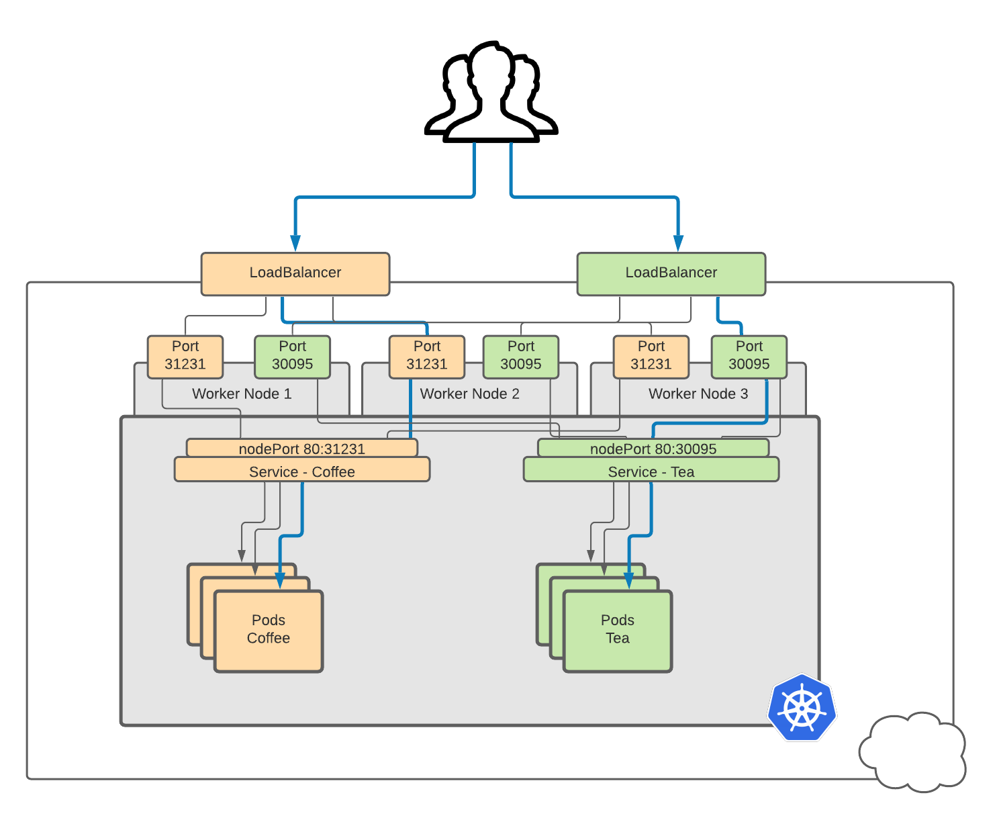
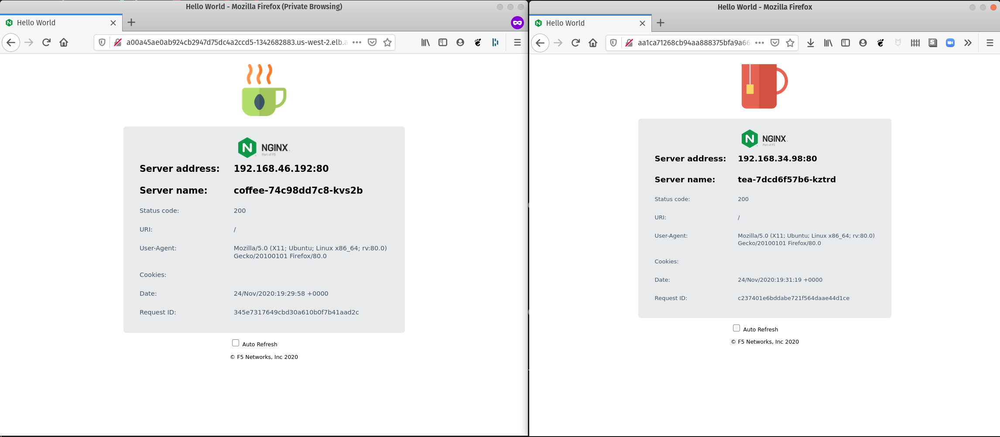

# External Load Balancer


> **Note:** This feature is only available for cloud providers or environments which support external load balancers.


When creating a service on a Kubernetes environments where external Load Balancer are supported (Most popular Cloud provides do),  you have the option of automatically creating a cloud network load balancer. This provides an externally-accessible IP Address and FQDN that sends traffic to the correct port on your cluster nodes 



Lets deploy a external load balancer for our **coffee** and **tea** service


## Deploy external load balancer for our services

1. To create an external load balancer on supported Kubernetes environments, its is as simple as inserting the following line to your [service configuration file](https://kubernetes.io/docs/concepts/services-networking/service/#loadbalancer):

```yaml
    type: LoadBalancer
```

We have pre-configured this in the `deployments/cafe-app/cafe-app-loadbalancer.yml`manifest file

2. Review the `deployments/cafe-app/cafe-app-loadbalancer.yml`manifest file

Noteworthy points about the `deployments/cafe-app/cafe-app-loadbalancer.yml`manifest:

* It contains both Deployment and Service specification in the same file for **coffee** and **tea** applications
* They are deployed in the **cafe** `namespace`
* LoadBalancer is been enabled using `type: LoadBalancer` in the ` Service` Deployment


3. Apply the `cafe-app-loadbalancer.yml`manifest to (re)deploy the **Coffee** and **Tea** services (`coffee-svc` and `tea-svc ` ) with `loadbalancer` Enabled

```
kubectl apply -f deployments/cafe-app/cafe-app-loadbalancer.yml
```

**Note:** This could also be achieved by patching a existing deployment with `loadbalancer` type, using the following imperative command: 

```bash
kubectl -n cafe patch svc coffee-svc -p '{"spec": {"type": "LoadBalancer"}}'
kubectl -n cafe patch svc tea-svc -p '{"spec": {"type": "LoadBalancer"}}'
```

4. Confirm the **Coffee** and **Tea** services (`coffee-svc` and `tea-svc ` ) are now with `TYPE loadBalancer`. You will see the External FQDN mappings under `EXTERNAL-IP `. Also You will notice that `ClusterIP` , an Internal only address, for those services coexist with `loadBalancer`, the  external  address

In the example below we see an external Address, `xxxx.[region].elb.amazonaws.com`,  map to a nodePort (`31231`) address mapping to port `80`for `coffee-svc`  and similarly for `coffee-svc` 

```
kubectl get deployments,services -n cafe

NAME                     READY   UP-TO-DATE   AVAILABLE   AGE
deployment.apps/coffee   1/1     1            1           3d23h
deployment.apps/tea      1/1     1            1           3d23h

NAME                 TYPE           CLUSTER-IP       EXTERNAL-IP                                                               PORT(S)        AGE
service/coffee-svc   LoadBalancer   10.100.104.173   a00a45ae0ab924cb2947d75dc4a2ccd5-1342682883.us-west-2.elb.amazonaws.com   80:31231/TCP   3d23h
service/tea-svc      LoadBalancer   10.100.23.145    aa1ca71268cb94aa888375bfa9a66653-1410168939.us-west-2.elb.amazonaws.com   80:30095/TCP   3d23h

```


## Test LoadBalancer from a external client

1. Get the `loadBalancer` Address for  our  **coffee** and **tea** services, then run a `curl` command to test access

```
# Get External loadBalancer address
COFFEE_LB=$(kubectl get services/coffee-svc -n cafe -o jsonpath='{.status.loadBalancer.ingress[*].hostname}')
TEA_LB=$(kubectl get services/coffee-svc -n cafe -o jsonpath='{.status.loadBalancer.ingress[*].hostname}')

# Coffee Service
curl -s http://$COFFEE_LB | grep title

# Tea Service
curl -s http://$TEA_LB | grep title
```

We should see the following output on a successful request:

```
 <title>Hello World</title>
```

You can also view it from your web browser:

```
firefox http://$COFFEE_LB
firefox http://$TEA_LB
```




## Remove LoadBalancer from our services

If we no longer want to expose our Services using LoadBalancer we can redeploy our Services without  `type` `loadBalancer`, this will reduce our Cloud Spend, since every component has a cost (e.g. [EKS Pricing](https://aws.amazon.com/eks/pricing/) )

1. Redeploy our **coffee** and **tea** Services without  `type` `loadBalancer`

**Note:** To avoid errors similar to `* spec.ports[0].nodePort: Forbidden: may not be used when `type` is 'ClusterIP'` when patching or replacing a spec with the `type` `loadBalancer` delpoyed, you can run the following commands to `--force` or set `nodePort","value":null`


```
# Attempt to force apply
kubectl apply -f deployments/cafe-app/cafe-app.yml --force

# Otherwise try...

# Patch coffee service
kubectl patch service cpffee-svc -n cafe --type='json' -p '[{"op":"replace","path":"/spec/type","value":"ClusterIP"},{"op":"replace","path":"/spec/ports/0/nodePort","value":null}]'

# Patch Tea service
kubectl patch service tea-svc -n cafe --type='json' -p '[{"op":"replace","path":"/spec/type","value":"ClusterIP"},{"op":"replace","path":"/spec/ports/0/nodePort","value":null}]'

```

2. Confirm the **Coffee** and **Tea** services (`coffee-svc` and `tea-svc ` ) are now back to `TYPE ClusterIP`. You will see the `NodePort`mappings under `PORT(S)` no longer exist. The `ClusterIP`  is back to an Internal only address 

```
kubectl get deployments,services -n cafe

NAME                     READY   UP-TO-DATE   AVAILABLE   AGE
deployment.apps/coffee   1/1     1            1           4d4h
deployment.apps/tea      1/1     1            1           4d4h

NAME                 TYPE        CLUSTER-IP       EXTERNAL-IP   PORT(S)   AGE
service/coffee-svc   ClusterIP   10.100.104.173   <none>        80/TCP    4d4h
service/tea-svc      ClusterIP   10.100.23.145    <none>        80/TCP    4d4h
```

