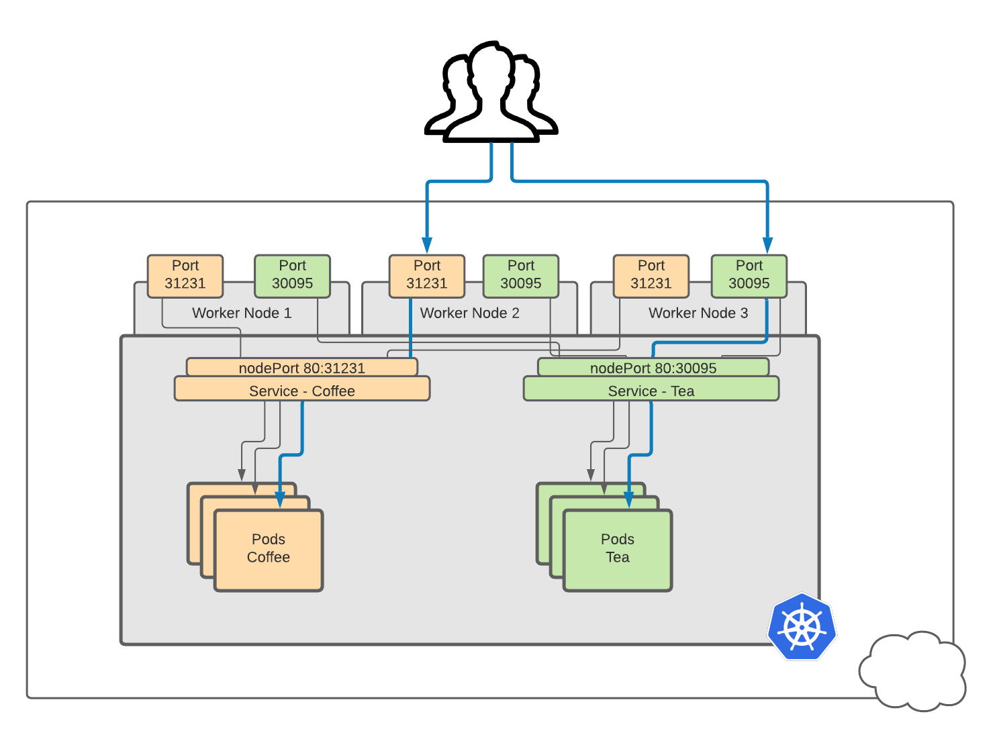
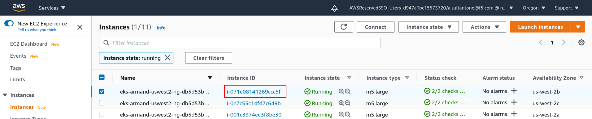
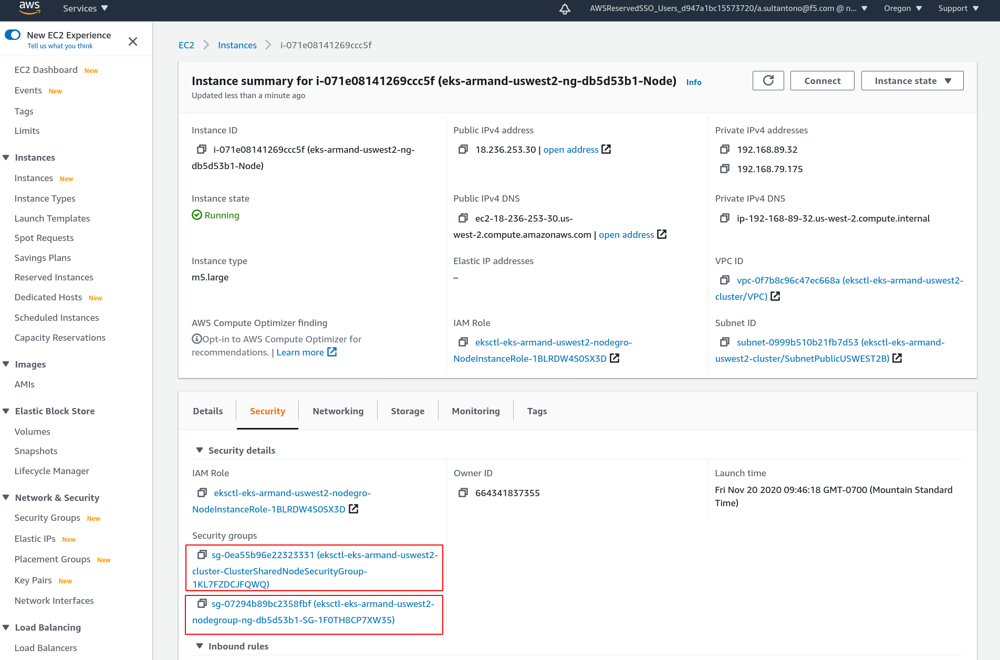
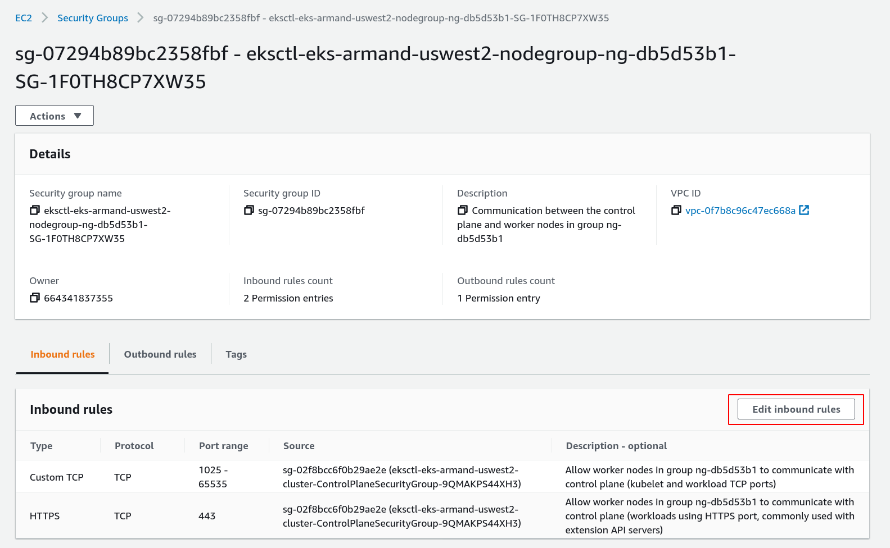
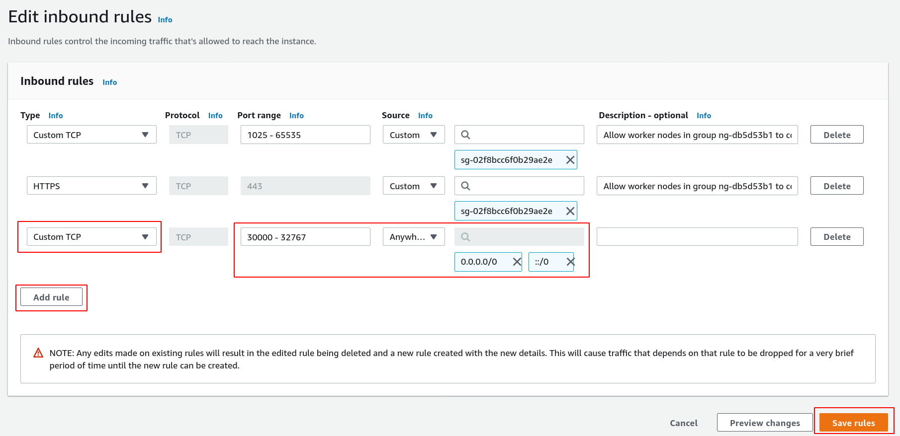
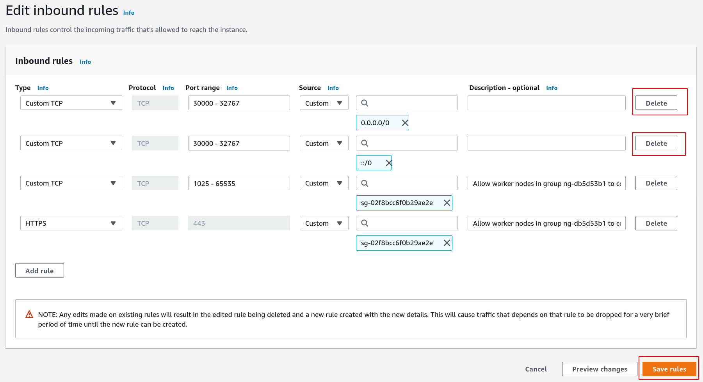

## NodePort


A **NodePort** exposes the **service** on a static port on the Kubernetes node IP address.

NodePorts are provisioned in the high port range (`30000-32767`)  by default, and so, NodePorts are unlikely to match a service’s intended port (for example, HTTP Port `80` may be exposed as `31020`).

To access the service from outside the cluster, you use the  public or private IP address of any worker node and the NodePort in the format `<IP_address>:<nodeport>`. Kubernetes worker nodes in VPC clusters typically do not have a public IP address and so you would need to connect to the NodePort from inside private VPC network. If there are external IPs routed to the nodes, then you should ensure firewall rules on all nodes allow access to the open port.




Lets expose NodePort for our **coffee** and **tea** services


## Expose NodePort for our services

1. Review the `deployments/cafe-app/cafe-app-nodeport.yml`manifest file

Noteworthy points about the `deployments/cafe-app/cafe-app-nodeport.yml`manifest:

* It contains both Deployment and Service specification in the same file for **coffee** and **tea** applications

* They are deployed in the **cafe** `namespace`
* NodePort is been enabled using `type: NodePort` in the `Service` Deployment
* A port was not specified (commented out), therefore, the Kubernetes system will chose a port in that range for you in the default `30000-32767` range.  

**Note:** You can set the NodePort range on your API server using the   `--service-node-port-range` option. 


2. Apply the `cafe-app-nodeport.yml`manifest to (re)deploy the **Coffee** and **Tea** services (`coffee-svc` and `tea-svc ` ) with `NodePort` Enabled

```
kubectl apply -f deployments/cafe-app/cafe-app-nodeport.yml
```

**Note:** This could also be achieved by updating a existing deployment with `NodePort` type, using the following imperative command: 

`````
kubectl expose deployment coffee  --type=NodePort  --name=coffee-svc
kubectl expose deployment tea  --type=NodePort  --name=tea-svc
`````

3. Confirm the **Coffee** and **Tea** services (`coffee-svc` and `tea-svc ` ) are now `TYPE NodePort`. You will see the `NodePort`mappings under `PORT(S)`.Also You will notice that `ClusterIP` , an Internal only address, for those services coexist with `NodePort` 

In the example below we see `Nodeport` `31231` map to `80`for `coffee-svc`, and `Nodeport` ` 30095` to `80`for `tea-svc`:

```
kubectl get deployments,services -n cafe

NAME                     READY   UP-TO-DATE   AVAILABLE   AGE
deployment.apps/coffee   1/1     1            1           3d9h
deployment.apps/tea      1/1     1            1           3d9h

NAME                 TYPE       CLUSTER-IP       EXTERNAL-IP   PORT(S)        AGE
service/coffee-svc   NodePort   10.100.104.173   <none>        80:31231/TCP   3d9h
service/tea-svc      NodePort   10.100.23.145    <none>        80:30095/TCP   3d9h
```

Now we have the `NodePort` address, we still need to pair that port with a the Kubernetes Node's IP address or FQDN to access from a external client. We can find that out in the next step

4. Get the Kubernetes worker Nodes` External-IP` using the following command

```
kubectl get nodes -o wide |  awk {'print $1" " $2 " " $7'} | column -t

NAME                                          STATUS  EXTERNAL-IP
ip-192-168-23-171.us-west-2.compute.internal  Ready   34.215.33.171
ip-192-168-48-90.us-west-2.compute.internal   Ready   54.191.50.101
ip-192-168-89-32.us-west-2.compute.internal   Ready   18.236.253.30
```

5. Before we test accessing **NodeIP:NodePort** from an outside cluster, we need to modify the security group of the nodes to **allow incoming traffic** through the port `30000-32767`.


I have not successfully done this via AWS CLI, so here is how you can do it via the AWS Management console:

**EC2 Instances** > Click on `Instance ID` for any Kubernetes Node  > under the **Security** Tab, click on any security group to edit the inbound rules > **Add Rule:** Custom TCP, Port range - `30000-32767` , Source - Anywhere (`0.0.0.0/0`) > **Save rules**












TODO:

```

MY_EKS=eks-armand-uswest2
MY_CLUSTER_SECURITY_GROUP_ID=$(aws eks describe-cluster --name $MY_EKS \
	--query 'cluster.resourcesVpcConfig.clusterSecurityGroupId' \
	--output text)
	

	
	# THIS WORKS
aws ec2  describe-security-groups \
	--filters "Name=tag:eksctl.cluster.k8s.io/v1alpha1/cluster-name,Values=$MY_EKS" \
	--query 'SecurityGroups[*].GroupName' 
	
	MY_CLUSTER_SECURITY_GROUP_ID=sg-02f8bcc6f0b29ae2e
	

# Update our security group to allow TCP 30000-32767
aws ec2 authorize-security-group-ingress \
	--group-id $MY_CLUSTER_SECURITY_GROUP_ID \
	--protocol tcp \
	--port 30000-32767 \
	--cidr 0.0.0.0/0
	
# Confirm FromPort and ToPort
aws ec2  describe-security-groups \
	--group-id $MY_CLUSTER_SECURITY_GROUP_ID \
	--query 'SecurityGroups[*].IpPermissions' 


	--filters "Name=tag:eksctl.cluster.k8s.io/v1alpha1/cluster-name,Values=$MY_EKS" \


 "Key": "eksctl.cluster.k8s.io/v1alpha1/cluster-name",
                    "Value": "eks-armand-uswest2"

	
	$ aws ec2 create-security-group --group-name my-sg --description "My security group" --vpc-id vpc-1a2b3c4d
{
    "GroupId": "sg-903004f8"
}

$ aws ec2 authorize-security-group-ingress --group-id sg-903004f8 --protocol tcp --port 3389 --cidr 203.0.113.0/24

```

## Test NodePort from a external client

1. Once again, get the Kubernetes worker Nodes` External-IP` using the following command

```
kubectl get nodes -o wide |  awk {'print $1" " $2 " " $7'} | column -t

NAME                                          STATUS  EXTERNAL-IP
ip-192-168-23-171.us-west-2.compute.internal  Ready   34.215.33.171
ip-192-168-48-90.us-west-2.compute.internal   Ready   54.191.50.101
ip-192-168-89-32.us-west-2.compute.internal   Ready   18.236.253.30
```

2. Pick a Node/External-IP from the last step and use `curl` to test external access using `nodePort`

```
NODE_EXTERNAL_IP=54.191.50.101
NODEPORT_COFFEE=31231
NODEPORT_TEA=30095

# Coffee Service
curl -s http://$NODE_EXTERNAL_IP:$NODEPORT_COFFEE | grep title

# Tea Service
curl -s http://$NODE_EXTERNAL_IP:$NODEPORT_COFFEE | grep title
```

We should see the following output on a successful request:

```
 <title>Hello World</title>
```


## Remove Security group 

When you are finished testing `nodePort` access, you can remove the security group created for this exercise:

I have not successfully done this via AWS CLI, so here is how you can do it via the AWS Management console:

**EC2 Instances** > Click on `Instance ID` for any Kubernetes Node  > under the **Security** Tab, click on any security group we previously edited the inbound rules > **Delete** Custom TCP, Port range - `30000-32767` , Source - Anywhere (`0.0.0.0/0`) and `::/0` > **Save rules**




## References

https://medium.com/faun/learning-kubernetes-by-doing-part-3-services-ed5bf7e2bc8e


