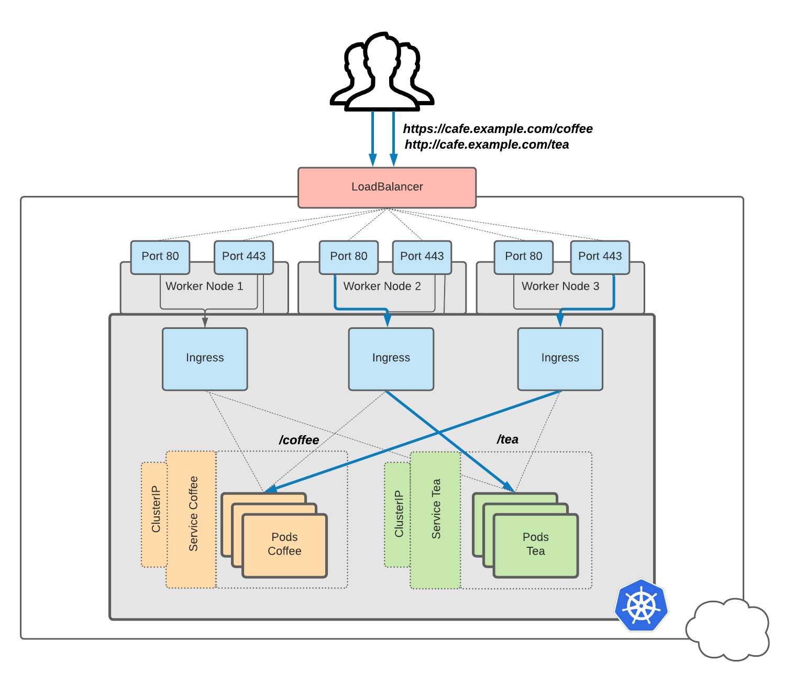
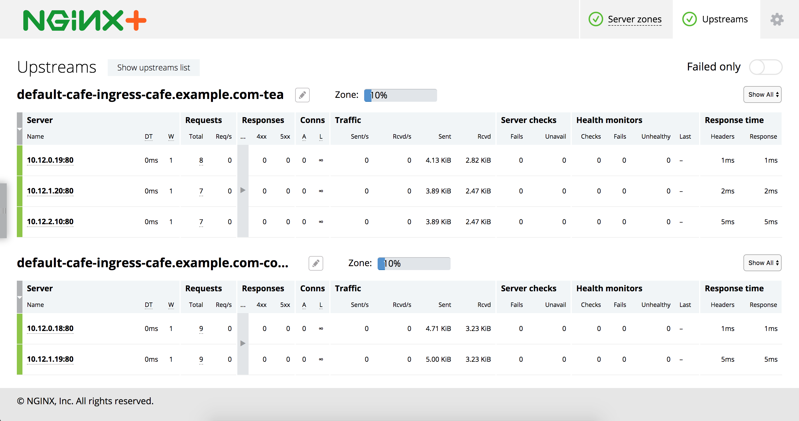

# Expose a sample application with ingress

Now we have an Ingress Controller to satisfy an Ingress. We can configure load
balancing for our sample web applications using an Ingress resource.


## Change back to lab project directory

1. For this excerise we will change back to the lab project directory:

```bash
cd lab-kubernetes-ingress
```

## 1. Deploy the Cafe Applications

1. Make sure our Coffee and Tea Application is running. Redeploy the [the sample
   Coffee and Tea
   Application](../deploy-sample-applications/deploy-sample-application.md) if
   needed

```bash
# Check the sample application is deployed and ready
k get deployment,service,pods -n cafe

NAME                     READY   UP-TO-DATE   AVAILABLE   AGE
deployment.apps/coffee   1/1     1            1           1d
deployment.apps/tea      1/1     1            1           1d

NAME                 TYPE        CLUSTER-IP       EXTERNAL-IP   PORT(S)   AGE
service/coffee-svc   ClusterIP   10.100.104.173   <none>        80/TCP    1d
service/tea-svc      ClusterIP   10.100.23.145    <none>        80/TCP    1d

NAME                          READY   STATUS    RESTARTS   AGE
pod/coffee-74c98dd7c8-5t6sq   1/1     Running   0          1d
pod/tea-7dcd6f57b6-kztrd      1/1     Running   0          1d
```

## 2. Deploy the Ingress Controller

1. Make sure NGINX Plus Ingress Controller is installed. After following the
   instructions to deploying NGINX Plus Ingress Controller with the
   [manifests](nginx-plus-ingress-controller-manifests-install.md) or helm, the
   Ingress Controller should now be publicly accessible 

## 3. Configure Load Balancing using Ingress

1. Create a secret with a self-signed SSL certificate and a key in the `cafe`
   namespace:

```bash
kubectl create -f deployments/cafe-app/cafe-secret.yml
```

2. Create an Ingress resource

Noteworthy points about `cafe-ingress.yml`:

 * A new `ingressClassName` field has been added to the Ingress spec in
   Kubernetes **>= 1.18** and is used to reference the `IngressClass` that
   should be used to implement this Ingress. When using Kubernetes **<1.18**,
   remove or comment out the `ingressClassName` field in the YAML file
 * The ingress resource will configure a virtual server listening on the FQDN,
   `cafe.example.com`, 
 * The ingress resource will configures URL path based routing, routing `/tea`
   to our tea service (`tea-svc`) and `/coffee` to our coffee service
   (`coffee-svc`)

```bash
# Create Ingress for cafe.example.com HTTP/S
kubectl create -f deployments/cafe-app/cafe-ingress.yml

# Check it has been deployed
kubectl get ingress -n cafe
NAME           CLASS   HOSTS              ADDRESS   PORTS     AGE
cafe-ingress   nginx   cafe.example.com             80, 443   67s

```
## 4. Access the Live Activity Monitoring

The [Live Activity Monitoring Dashboard](#nginx-plus-dashboard) will allow us to see the real time
activity metrics on our Ingress Controller upon scaling our applications (Pods)

Note: The NGINX Plus dashboard displaying metrics is from a a **single Pod** and
a tool such as Grafana dashboards would need to be used to show **aggregated**
metrics across all Pods in a Ingress Controller Cluster

 1. To get Access the Live Activity Monitoring Dashboard using `kubectl
    port-forward` on a single Ingress Controller pod, run the following:

**Note:** The port is only forwarded while the kubectl process is running, and
so the following command will consume a terminal window

```bash
# Access the Live Activity Monitoring Dashboard
kubectl get pods --namespace=nginx-ingress
kubectl port-forward <nginx-plus-ingress-pod> 8080:8080 --namespace=nginx-ingress 
```

2. Open the NGINX Plus dashboard in a web browser on [http://127.0.0.1:8080/dashboard.html](http://127.0.0.1:8080/dashboard.html)



## 5. Test the sample application with Ingress

1. Save the public IP address of the Ingress controller into a shell variable.
   Refer to lab excerises to obtain the public IP address when using:
 * [`daemonSet`](nginx-plus-ingress-controller-manifests-install.md#deploy-ingress-controller-daemonSet)
 * [`nodePort`](nginx-plus-ingress-controller-manifests-install.md#nodeport-service)
 * [`loadBalancer`](nginx-plus-ingress-controller-manifests-install.md#loadbalancer-service)

```bash
# save the IP Address of the Ingress controller into a shell variable
# This will be the LoadBalancer IP address when using service loadBalancer, or
# A worker node IP address for a daemonSet or when using service nodePort
IC_IP=XXX.XXX.XXX.XXX

# save the HTTPS Port of the Ingress controller into a shell variable:
# This will not be port 443 when using nodePort
IC_HTTPS_PORT=XXX
```

1. Use `curl` to test external access to the sample coffee and the tea services. 
   You may need to use `curl`'s `--insecure` option to turn off certificate verification of our
   self-signed certificate and the `--resolve` option to set the Host header of a
   request with `cafe.example.com`

For example, [accessing our sample
application](#accessing-sample-application-with-lb-and-ingress) with
`Loadbalancer` and Ingress Controller :

```bash
# Get External loadBalancer address
LB_FQDN=$(kubectl get services/nginx-ingress -n nginx-ingress -o jsonpath='{.status.loadBalancer.ingress[*].hostname}')
# Get loadBalancer IP address
IC_IP=$(dig +short $LB_FQDN A |  awk 'NR==1')

# Get coffee
curl https://cafe.example.com/coffee --insecure \
    --resolve cafe.example.com:80:$IC_IP \
    --resolve cafe.example.com:443:$IC_IP

# Get tea:
curl https://cafe.example.com/tea --insecure \
    --resolve cafe.example.com:80:$IC_IP \
    --resolve cafe.example.com:443:$IC_IP
```

You can also add a temporary host file entry and view the application in your web browser

```bash
echo "$IC_IP cafe.example.com" | sudo tee -a /etc/hosts
open https://cafe.example.com/coffee
open https://cafe.example.com/tea
```

### 6. Check "under the hood" of the Nginx Pod

 1. Look at the NGINX logs

```bash
# Find the Ingress controller pod name
kubectl get pods --namespace=nginx-ingress

# See the Ingress controller logs. -f for follow
kubectl logs <name> --namespace=nginx-ingress -f
```

 2. `exec` into the container and check out the nginx config and logs

```bash
# Connect into the container
kubectl exec -it <name> --namespace=nginx-ingress -- bash
kubectl exec -it <name> --namespace=nginx-ingress -- /bin/bash

# See full Nginx config
nginx -T
```
