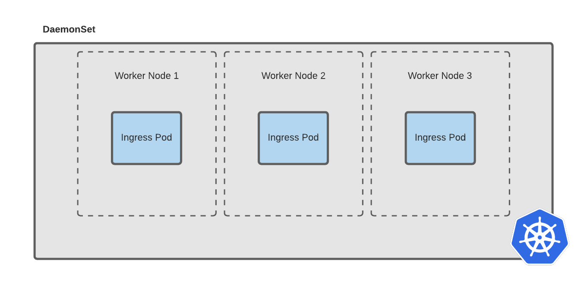

# NGINX Plus Ingress Controller using Manifests

We can now install the NGINX Ingress controller using the Kubernetes
[manifests](https://docs.nginx.com/nginx-ingress-controller/installation/installation-with-manifests/)
or the [helm
chart](https://docs.nginx.com/nginx-ingress-controller/installation/installation-with-helm/).

In this guide we will deploying the NGINX plus Ingress controller using the
Kubernetes manifests. For most up-to-date instructions, please follow the
documenation on
[docs.nginx.com](https://docs.nginx.com/nginx-ingress-controller/installation/installation-with-manifests/)
and be sure to install the **NGINX Plus** Ingress controller. 

## Clone the NGINX Plus Ingress controller repo and change to this directory

1. Clone the NGINX Plus Ingress controller and change into this project
   directory for the duration of this lab excerise

```bash
git clone https://github.com/nginxinc/kubernetes-ingress/
cd kubernetes-ingress
git checkout v1.9.1
```

## Building the NGINX Plus ingress v1.9.1

NGINX Plus container images are always required to be built and pushed to a
**private** container registry since each NGINX Plus deployment depends on the
customer's unique subscription certificate and key, and potentially dynamic
modules and unique optimizations as a requirement for use cases

In this guide we will building the NGINX plus Ingress controller and pushing it
to a private container registry, AWS ECR, as the example, and assuming we are
already
[authenicated](https://docs.aws.amazon.com/AmazonECR/latest/userguide/Registries.html)
(logged in). For most up-to-date instructions, please follow the documenation on
[docs.nginx.com](https://docs.nginx.com/nginx-ingress-controller/installation/building-ingress-controller-image/)
and be sure to build the **NGINX Plus** Ingress controller. 

1. Place your NGINX Plus certificate and key into the root folder, as we will
   need it to build the container image

```bash
# Place your certificate and key into the cloned kubernetes-ingress repo folder
cd kubernetes-ingress
ls nginx-repo*

nginx-repo.crt nginx-repo.key
```


2. Build the NGINX Plus Ingress Controller Image and push the image to a private
   registry using the `make` script provided. For Detailed instructions see
   [Building the Ingress Controller
   Image](https://docs.nginx.com/nginx-ingress-controller/installation/building-ingress-controller-image/),
   and always use the stable build for production!

In this example, I am building the **stable build** of the NGINX Plus Ingress
Controller Image and pushing it to my [ECR private
repository](../aws/aws-cli-eks-ecr-setup-guide.md). Before running the `make`
script, I first [authenicate to our
ECR](../aws/aws-cli-eks-ecr-setup-guide.md#authenicate-to-ecr) and create a
Ingress repo for my image

**Example prerequsites when using ECR**
```bash
# Retrieve authentication token and authenticate your Docker client to your registry
MY_AWS_ACCOUNT_ID=$(aws sts get-caller-identity --query 'Account' --output text)
MY_REGION=us-west-2

aws ecr get-login-password --region $MY_REGION | docker login --username AWS --password-stdin $MY_AWS_ACCOUNT_ID.dkr.ecr.$MY_REGION.amazonaws.com

# Create an ECR repository for the NGINX Plus Ingress Controller Image
MY_REGION=us-west-2
MY_REPO="armand/nginx-plus-ingress"
aws ecr create-repository --repository-name $MY_REPO --region $MY_REGION
```

**Now Build the Image and push the image to a private registry**
```bash
# Build the nginx-plus-ingress stable debian image (default) 
# Note: Alpine is not supported for NGINX Plus (only OSS)
# See Docs for other builds (Dockerfiles) :
# https://docs.nginx.com/nginx-ingress-controller/installation/building-ingress-controller-image/
MY_AWS_ACCOUNT_ID=$(aws sts get-caller-identity --query 'Account' --output text)
MY_REGION=us-west-2
MY_REPO="armand/nginx-plus-ingress"

# the output below will look like 
# MY_REGISTRY=664341837355.dkr.ecr.us-west-2.amazonaws.com/armand/nginx-plus-ingress
MY_REGISTRY=664341837355.dkr.ecr.$MY_REGION.amazonaws.com/$MY_REPO

make clean && make DOCKERFILE=DockerfileForPlus PREFIX=$MY_REGISTRY
```

Check it is there using the aws cli

```bash
MY_REGION=us-west-2
aws ecr describe-repositories --region $MY_REGION | grep nginx-plus-ingress
```

Or in the AWS Management web Console:

```bash
MY_REGION=us-west-2
open https://$MY_REGION.console.aws.amazon.com/ecr/repositories\?region\=$MY_REGION
```

As a result, the image
`664341837355.dkr.ecr.us-west-2.amazonaws.com/armand/nginx-plus-ingress:1.9.1`
is built and pushed to the registry. Note that the tag `1.9.1` comes from the
`VERSION` variable, it it latest version of the time of writing and is defined
in the Makefile by default

**Note:** If you pushing to a private registry that you Kubernetes cluster does
not default access to (e.g. [Docker Hub](https://hub.docker.com/)) you will need
to configure an access method such as
[`secrets`](https://kubernetes.io/docs/concepts/configuration/secret/) to pull
an image from a private Docker registry or repository. See [Enable kubernetes to
Pull an Image from your Private
Registry](../secrets/secrets-for-private-registry.md)

## Create required resources for NGINX Ingress

Now that we have the NGINX Ingress Controller container image readily available
on your container registry, we can now install the NGINX Ingress controller.

In this guide we will deploying the NGINX plus Ingress controller using the
Kubernetes manifests. For most up-to-date instructions, please follow the
documenation on
[docs.nginx.com](https://docs.nginx.com/nginx-ingress-controller/installation/installation-with-manifests/)
and be sure to install the **NGINX Plus** Ingress controller. 

The Instructions below are taliored for our lab and will install the 
NGINX Ingress controller `v1.9.1` using  Kubernetes manifests:

### Checkout the correct code version for NGINX Ingress (v1.9.1) 

1. In our Ingress controller repo change into the deployments folder and make
   sure we have checkout the desired version (`v1.9.1`):

```bash
cd kubernetes-ingress/deployments
git checkout v1.9.1
```

### Configure RBAC

1. Review the following files to configure RBAC. We will creating a `Namespace`
   and `ServiceAccount` called `nginx-ingress` and the Role-based access control
   (RBAC) or `ClusterRole` containing rules that represent a set of permissions
   granted to the `nginx-ingress` `ServiceAccount`. See Noteworthy points below

`ns-and-sa.yml` manifest: 
 * Specification for the **nginx-ingress** `namespace` where the NGINX Ingress
   will later be deployed into
 * Specification for the **nginx-ingress** `ServiceAccount` used to provide an
   identity for pods. Pods that want to interact with the API server will
   authenticate with a particular service account. Note that, by default,
   applications will authenticate as the default service account in that
   namespace

`rbac.yaml` manifest:
 * A `ClusterRole` is a non-namespaced resource, unlike a `Role` that always
   sets permissions within a particular namespace. A `ClusterRole` can be used to: 
    * define permissions on namespaced resources and be granted within
      individual namespace(s)
    * define permissions on namespaced resources and be granted across all
      namespaces
    * define permissions on cluster-scoped resources
 * A `ClusterRoleBinding` is used to grant permissions across a whole cluster,
   the `ClusterRoleBinding` allows a list of subjects (users, groups, or
   serviceAccounts) to the role being granted. In this deployment the subject
   its the `ServiceAccount` called `nginx-ingress`

2. Now apply the manifests to configure RBAC

```bash
# Create a namespace and a service account for the Ingress controller:
kubectl apply -f common/ns-and-sa.yaml

# Create a cluster role and cluster role binding for the service account:
kubectl apply -f rbac/rbac.yaml
```
### Create Common Resources

1. Review the following files to create Common Resources for most of the Ingress
   Controller installations. See Noteworthy points below

`default-server-secret.yaml` manifest:
 * For testing purposes we are using a self-signed certificate. However, we
   recommend that you use your own certificate and key (See: [Creating
   Kubernetes Secrets for TLS](../secrets/create-secrets-for-tls.md))

`nginx-config.yaml` manifest:
 * The `ConfigMap` resources allows you to customize or fine tune NGINX that
   **applies globally** (i.e. the `http` context in nginx.conf), meaning that it
   affects every Ingress resource (In contrast, annotations always apply to
   their Ingress resource)
 * The `ConfigMap` resource stores configuration data as key-value pairs.
 * `ConfigMaps` allow you to decouple configuration artifacts from image content
   to keep containerized applications portable
 * See more information on [NGINX Plus Ingress Controller ConfigMap
   Resource](https://docs.nginx.com/nginx-ingress-controller/configuration/global-configuration/configmap-resource/)

`ingress-class.yaml` manifest:
 * The `IngressClass` concept allows the coexistence of multiple Ingress
   Controllers in one cluster
 * Each Ingress should specify a class, i.e a reference to an `IngressClass`
   resource (find `ingressClassName` in a ingress spec) and the `IngressClass`
   resource contains additional configuration including the name of the
   controller that should implement the class.
 * Note: For Kubernetes `>= 1.18`, if the class is not set in an Ingress
   resource, Kubernetes will set it to the class of the default Ingress
   Controller. To make a Ingress Controller the default one, the
   `ingressclass.kubernetes.io/is-default-class: "true"` must be set on the
   IngressClass resource. We have this commented out in our example

2. Now apply the manifests to create Common Resources common for most of the
   Ingress Controller installations. 

```bash
# Create a secret with a TLS certificate and a key for the default server in NGINX:
kubectl apply -f common/default-server-secret.yaml

# Create a config map for customizing NGINX configuration:
kubectl apply -f common/nginx-config.yaml

# Create an IngressClass resource (for Kubernetes >= 1.18):
kubectl apply -f common/ingress-class.yaml
```

### Create Custom Resources

In this section we will deploy CRDs to expand the capabilites of NGINX Plus
ingress

A Custom Resources allows you to create your own API objects, allows you to
extend Kubernetes capabilities by adding any kind of API object useful for your
application, it allows you to define your own kind just like Pod, Deployment,
ReplicaSet, etc.
#### `VirtualServer`, `VirtualServerRoute`, `TransportServer` and `Policy` resources

1. Review the custom resource definitions for `VirtualServer` and
   `VirtualServerRoute`, `TransportServer` and `Policy` resources
 * The [`VirtualServer` and `VirtualServerRoute`
   Resources](https://docs.nginx.com/nginx-ingress-controller/configuration/virtualserver-and-virtualserverroute-resources/)
   are new load balancing configuration, introduced in **release 1.5** as an
   alternative to the Ingress resource.
 * These Custom Resources enable use cases not supported with the Ingress such
   as traffic splitting and advanced content-based routing. 
 * The following manifest files define our `CustomResourceDefinition` (CRD), and
   the Kubernetes API Server will creates a new RESTful resource path for each
   version specified.
 * By default, a CRD is `Cluster`-scoped, however these CRDs are all in
   `Namespaced` scope as specified in the CRD's `scope` field in the manifests,
   which means all the resources of this kind are managed under a certain
   namespace and will be removed if you delete the namespace

2. Now apply the manifests to create the Custom Resources for NGINX Plus Ingress
   Controller

```bash
# Create custom resource definitions for VirtualServer and VirtualServerRoute, 
# TransportServer and Policy resources:
kubectl apply -f common/vs-definition.yaml
kubectl apply -f common/vsr-definition.yaml
kubectl apply -f common/ts-definition.yaml
kubectl apply -f common/policy-definition.yaml
```
#### GlobalConfiguration resource

1. Review the additional CRD, `GlobalConfiguration`,  to enable TCP and UDP load
   balancing features of the NGINX Plus Ingress Controller, create the following
   additional resources:

 * [`GlobalConfiguration`](https://docs.nginx.com/nginx-ingress-controller/configuration/global-configuration/globalconfiguration-resource/)
   is another  Custom Resource and defines the global configuration parameters
   of the Ingress Controller.
 * This `GlobalConfiguration` resource supports configuring listeners for TCP
   and UDP load balancing, required by [`TransportServer`
   resources](https://docs.nginx.com/nginx-ingress-controller/configuration/transportserver-resource/)
   which is a **preview feature in v1.9**

2. Optionally, apply the manifests to create the Custom Resources for NGINX Plus
   Ingress Controller

```bash
# Create a custom resource definition for GlobalConfiguration resource:
kubectl apply -f common/gc-definition.yaml

# Create a GlobalConfiguration resource:
kubectl apply -f common/global-configuration.yaml
```

#### Resources for NGINX App Protect

1. Review and apply the manifests to create the additional CRD, `APPolicy` and
   `APLogConf` to enable the NGINX Plus App Protect module

```bash
# Create a custom resource definition for APPolicy and APLogConf
kubectl apply -f common/ap-logconf-definition.yaml 
kubectl apply -f common/ap-policy-definition.yaml 
```

## Deploy the Ingress Controller

We include two options for deploying the Ingress controller:

 * `DaemonSet`. Use a `DaemonSet` for deploying the Ingress controller on every
   node or a subset of nodes.
 * `Deployment`. Use a `Deployment` if you plan to dynamically change the number
   of Ingress controller replicas.

 

### Option 1: Deploy the Ingress Controller as a DaemonSet

This section will deploy the [Ingress Controller as a
`DaemonSet`](#deploy-ingress-controller-daemonSet), and is based on
Documentation on [Installing NGINX Ingress Controller for
Kubernetes](https://docs.nginx.com/nginx-ingress-controller/installation/installation-with-manifests/)

The `DaemonSet` will create ports mappings for port **80** and **443** of the
Ingress controller container to the same ports of the worker nodes where the
container is running and so the Ingress pods are reachable via the node IPs.
Since Clients would need to know the list of node IPs somehow, a `DaemonSet` is
typically deployed with a loadBalancer in front of to provide load balancing of
all ingress pods in a `DaemonSet`

1. Update the `daemon-set/nginx-plus-ingress.yaml` with the container image that
   you have built

For example, replace the `nginx/nginx-ingress:1.9.1` placeholder:

```yaml
#...
  # `-image: nginx/nginx-ingress:1.9.1
  -image: 664341837355.dkr.ecr.us-west-2.amazonaws.com/armand/nginx-plus-ingress:1.9.1
#...
```

2. Deploy NGINX Plus Ingress Controller as a DaemonSet, and Kubernetes will
   create an Ingress controller pod on every node of the cluster.

```bash
# For NGINX Plus, run:
kubectl apply -f daemon-set/nginx-plus-ingress.yaml
```

3. Run the following command to make sure that the Ingress controller pods are
   running and assoicated with a `DaemonSet`:

```bash
# Unless you have specified the namespace, the manifests applied will designate
# `nginx-plus-ingress` as the target namespace to deploy our Ingress Controllers
 kubectl get pods,daemonset --namespace=nginx-ingress
```

4. To access ingresswe need to modify the security group of the Kubernetes nodes
   to **allow incoming traffic** through the port `80` and `443`. Refer to our
   previous excerise on [`NodePort`: Modifying the security group to allow
   incoming traffic on
   nodePorts](../exposing-services/node-port.md#modify-security-group-nodeport),
   however in this case we want to open ports `80` and `443` to the internet.


5. Get the Kubernetes worker Nodes` External-IP` using the following command

```bash
kubectl get nodes -o wide |  awk {'print $1" " $2 " " $7'} | column -t

NAME                                          STATUS  EXTERNAL-IP
ip-192-168-23-171.us-west-2.compute.internal  Ready   34.215.33.171
ip-192-168-48-90.us-west-2.compute.internal   Ready   54.191.50.101
ip-192-168-89-32.us-west-2.compute.internal   Ready   18.236.253.30
```

6. Once, security groups on your cloud provider is open to allow incoming
   traffic on hostPorts `80` and `443`, pick a Node/External-IP along with the
   nodePort from the last step and use `curl` to test external access

```bash
# External IP address to a node and port 80 mapping
NODE_EXTERNAL_IP=34.215.33.171

# Test host HTTP port 80
curl -s http://$NODE_EXTERNAL_IP | grep nginx

# Test host HTTPS port 443
curl -s -k https://$NODE_EXTERNAL_IP | grep nginx
```

**Note:** The default server returns a `HTTP 404 Not Found page` or `HTTP400 bad
request `status code for all requests for domains for which there are no Ingress
rules defined.

We should see the following output if NodepPort is configured correctly for
ingress:

```html
<hr><center>nginx/1.19.0</center>
```

### Option 2: Deploy the Ingress Controller as a Deployment

This section will deploy the [Ingress Controller as a
`Deployment`](#deploy-ingress-controller-deployment), and is based on
Documentation on [Installing NGINX Ingress Controller for
Kubernetes](https://docs.nginx.com/nginx-ingress-controller/installation/installation-with-manifests/)

1. If you want to remove an existing nginx-ingress `DaemonSet` from the last
   section before deploying nginx-ingress as a `deployment`, you can run the
   following command:

```bash
kubectl delete daemonset/nginx-ingress -n nginx-ingress
```

1. Update the `deployment/nginx-plus-ingress.yaml` with the container image that
   you have built

for example replace the `nginx/nginx-ingress:1.9.1` placeholder:

```yaml
#...
  # `-image: nginx/nginx-ingress:1.9.1
  -image: 664341837355.dkr.ecr.us-west-2.amazonaws.com/armand/nginx-plus-ingress:1.9.1
#...
```

2. Deploy NGINX Plus Ingress Controller as a Deployment and by default,
   Kubernetes will create one Ingress controller pod.

```bash
# For NGINX Plus, run:
kubectl apply -f deployment/nginx-plus-ingress.yaml
```

3. Run the following command to make sure that the Ingress controller pods are
   running:

```bash
# Unless you have specified the namespace, the manifests applied will designate
# `nginx-plus-ingress` as the target namespace to deploy our Ingress Controllers
# Check installation and get a current count of ingress pods 
kubectl get pods --namespace=nginx-ingress
```

4. To Scale the number of Ingress Pods run and check updated deployment

```bash
# As an example, scale to four pods:
kubectl scale deployments/nginx-ingress --replicas=4 -n nginx-ingress

# Check deployment progres and get a current count of ingress pods
# and see which worker nodes they are deployed on
kubectl get deployments,pods -n nginx-ingress -o wide
```

5. Get Access to the Ingress Controller. If you created a `deployment`, below
   are two options for accessing the Ingress controller pods:
 * `NodePort` service
 * `LoadBalancer` service

#### `NodePort` service

1. Create a service with the type [`NodePort`](#nodeport-service) by applying the manifest

```bash
kubectl create -f service/nodeport.yaml
```

2. Confirm a `nodePort` service has been assigned and maps to your Ingress pods

```bash 
# look at PORT(S) column fo rport 80 and 443 Mapping 
kubectl get service -n nginx-ingress -o wide

NAME            TYPE       CLUSTER-IP      EXTERNAL-IP   PORT(S)                      AGE   SELECTOR
nginx-ingress   NodePort   10.100.72.175   <none>        80:31203/TCP,443:30338/TCP   44s   app=nginx-ingress
```

3. Before we test accessing **NodeIP:NodePort** from an outside cluster, we need
   to modify the security group of the Kubernetes nodes to **allow incoming
   traffic** through the the high ports `30000-32767`. Refer to our previous
   excerise on [`NodePort`: Modifying the security group to allow incoming
   traffic on
   nodePorts](../exposing-services/node-port.md#modify-security-group-nodeport)


4. Get the Kubernetes worker Nodes` External-IP` using the following command

```
kubectl get nodes -o wide |  awk {'print $1" " $2 " " $7'} | column -t

NAME                                          STATUS  EXTERNAL-IP
ip-192-168-23-171.us-west-2.compute.internal  Ready   34.215.33.171
ip-192-168-48-90.us-west-2.compute.internal   Ready   54.191.50.101
ip-192-168-89-32.us-west-2.compute.internal   Ready   18.236.253.30
```

5. Once, security groups on your cloud provider is open to allow incoming
   traffic on nodePorts, pick a Node/External-IP along with the nodePort from
   the last step and use `curl` to test external access

```bash
# External IP address to a node and port 80 mapping
NODE_EXTERNAL_IP=34.215.33.171
NODEPORT=31203

# Test NodePort
curl -s http://$NODE_EXTERNAL_IP:$NODEPORT | grep nginx
```

**Note:** The default server returns a `HTTP 404 Not Found page` or `HTTP400 bad
request `status code for all requests for domains for which there are no Ingress
rules defined.

We should see the following output if NodepPort is configured correctly for
ingress:

```html
<hr><center>nginx/1.19.0</center>
```

##### Remove NodePort services

1. If we no longer want to expose our Services using `NodePort` we can simply
   delete the `nginx-ingress` service exposing Nodeport

```bash
# delete the nodePort service only!
kubectl delete service/nginx-ingress -n nginx-ingress

# Check it is deleted. We should see the following output
kubectl get service -n nginx-ingress -o wide

No resources found in nginx-ingress namespace.
```

2. Lastly, there is no need to expose NodePorts on your nodes and you can once
   again [remove Security
   group](../exposing-services/nodeport.md#remove-security-group) 


#### `LoadBalancer` service

1. Create a [`LoadBalancer`](#loadbalancer-service) service by applying the
   appropriate manifest for your cloud provider

**For AWS, run:**
```bash
# AWS ELB
kubectl apply -f service/loadbalancer-aws-elb.yaml
```

**Or, for Azure or GCP, run:**
```bash
# GCP or Azure Load Balancer
kubectl apply -f service/loadbalancer.yaml
```

2. Confirm there is a `nginx-ingress` services with `TYPE loadBalancer`. You
   will see the External FQDN mappings under `EXTERNAL-IP `. Also You will
   notice that `ClusterIP` , an Internal only address, for those services
   coexist with `loadBalancer`, the  external  address

In the example below we see an external Address,
`xxxx.[region].elb.amazonaws.com`,  map to a nodePort (`30950`) address mapping
to port `80` and  nodePort (`31362`) port `443`

```bash
kubectl get deployments,services -n nginx-ingress

NAME                            READY   UP-TO-DATE   AVAILABLE   AGE
deployment.apps/nginx-ingress   1/1     1            1           23h

NAME                    TYPE           CLUSTER-IP     EXTERNAL-IP                                                              PORT(S)                      AGE
service/nginx-ingress   LoadBalancer   10.100.49.80   a05738aa7590143efb2dee375aff3c7d-398521528.us-west-2.elb.amazonaws.com   80:30950/TCP,443:31362/TCP   2m9s
```

**Note:**  Kubernetes has allocate a Classic Load Balancer (ELB) in TCP mode with the PROXY protocol enabled to pass the client’s information (the IP address and the port). In the next step we must configure NGINX to use the PROXY protocol.

3. **Important:** configure NGINX to use the PROXY protocol. Add the following keys in the `data` section of the config map file `nginx-config.yaml` from a previous step to avoid `HTTP 400 bad Requests`

```yaml
kind: ConfigMap
apiVersion: v1
metadata:
  name: nginx-config
  namespace: nginx-ingress
data:
  proxy-protocol: "True"
  real-ip-header: "proxy_protocol"
  set-real-ip-from: "0.0.0.0/0"
```

4. Update the `nginx-config.yaml` config map:

```bash
# Apply our configMap changes
kubectl apply -f common/nginx-config.yaml

# View updated configMap
kubectl describe configmap/nginx-config -n nginx-ingress
```

5. Test access to ingress usings `LoadBalancer` from an external client. Get the
   `loadBalancer` Address for  our **nginx-ingress** service, then run a `curl`
   command to test access

```bash
# Get External loadBalancer address
LB=$(kubectl get services/nginx-ingress -n nginx-ingress -o jsonpath='{.status.loadBalancer.ingress[*].hostname}')

# Access Ingress through LoadBalancer
curl -s http://$LB | grep nginx
```

**Note:** The default server returns a `HTTP 404 Not Found page` or `HTTP400 bad
request` status code for all requests for domains for which there are no Ingress
rules defined.

We should see the following output if `loadBalancer` is configured correctly for
ingress:

```html
<hr><center>nginx/1.19.0</center>
```
 
##### Remove LoadBalancer services

1. If we no longer want to expose our Services using `LoadBalancer` we can
   simply delete the `nginx-ingress` service using `LoadBalancer`

```bash
# delete the nodePort service only!
kubectl delete service/nginx-ingress -n nginx-ingress

# Check it is deleted. We should see the following output
kubectl get service -n nginx-ingress -o wide

No resources found in nginx-ingress namespace.
```

## Deploy Ingress!

Now we have an Ingress Controller to satisfy an Ingress. We can configure load
balancing for our sample web applications using an Ingress resource. See: [Expose a sample application with ingress](expose-sample-app-with-ingress.md)


## Uninstall the Ingress Controller

Unless you have specified the namespace, the example manifests designate
`nginx-plus-ingress` as the target namespace to deploy our Ingress Controllers

1. Delete the `nginx-ingress` namespace to uninstall the Ingress controller
   along with all the auxiliary resources that were created:

```bash
# Delete the `nginx-ingress` along with the Ingress controller and 
# all the auxiliary resources that were created:
kubectl delete namespace nginx-ingress

# Delete non-namespaced resources,  ClusterRole and ClusterRoleBinding 
kubectl delete clusterrole nginx-ingress
kubectl delete clusterrolebinding nginx-ingress
```

## Resources
 * [Kuberenetes Docs:
   Ingress](https://kubernetes.io/docs/concepts/services-networking/ingress/)
 * [Extend the Kubernetes API with
   CustomResourceDefinitions](https://kubernetes.io/docs/tasks/extend-kubernetes/custom-resources/custom-resource-definitions/)
 * [Kubernetes Custom Resource Definition (CRDs)
   Explained](https://www.bmc.com/blogs/kubernetes-crd-custom-resource-definitions/)


