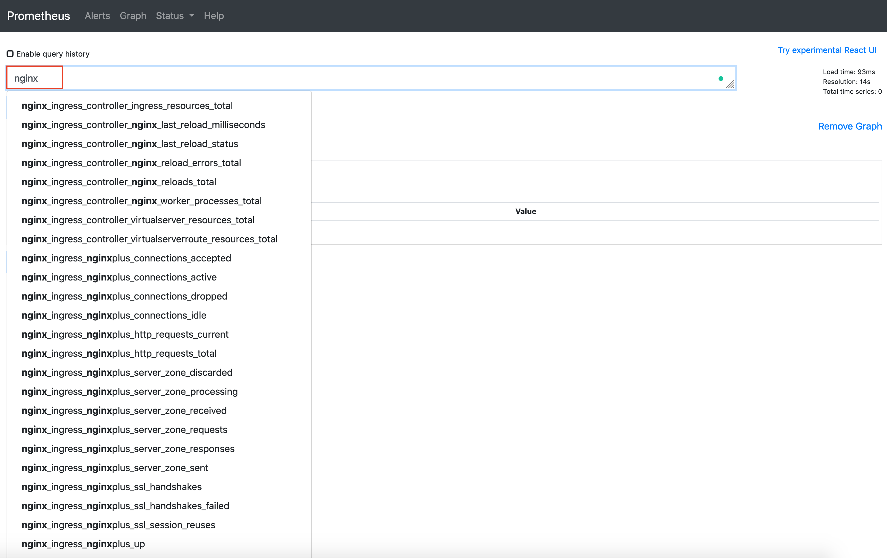
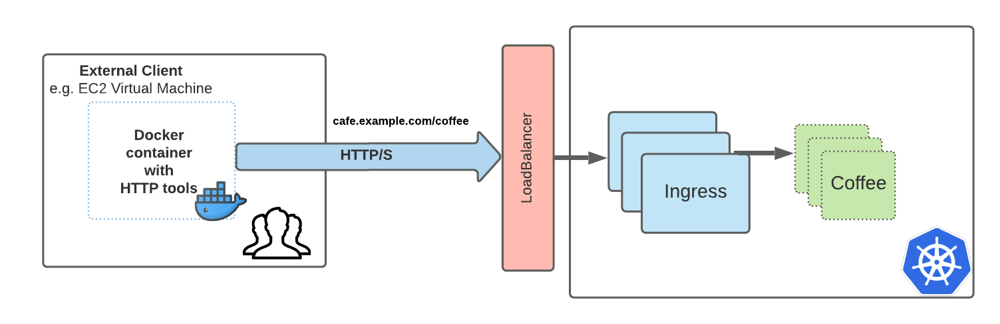

# Enable NGINX Plus Ingress Controller metrics for Prometheus using Kubernetes manifests 

The Ingress Controller exposes many metrics in the Prometheus format. Those
include NGINX/NGINX Plus and the Ingress Controller metrics. If you’re using
Kubernetes manifests (`Deployment` or `DaemonSet`) to install the Ingress
Controller, we can enable Prometheus metrics by defining the appropriate specs
in the manifests.

In this guide, we will expose NGINX plus Ingress controller Metrics for
Prometheus using the Kubernetes manifests. For the most up-to-date instructions,
please follow the documentation on
[docs.nginx.com](https://docs.nginx.com/nginx-ingress-controller/logging-and-monitoring/prometheus/)

1. Enter the NGINX Plus Ingress controller project into the deployments folder
   again, and make sure we have checkout the desired version (`v1.9.1`): - we
   will be working from this directory for the duration of this lab exercise

```bash
cd kubernetes-ingress/deployments
git checkout v1.9.1
```

2. Check whether you have deployed your NGINX Plus Ingress Controller as a
   `Deployment` or `DaemonSet` and enter the correct subdirectory

Check whether you have deployed your NGINX Plus Ingress Controller as a
`Deployment` or `DaemonSet`

```bash
# Get deployments
kubectl get deployments -n nginx-ingress

# Get daemonset
kubectl get daemonset -n nginx-ingress
```

Now enter the correct sub-folder, important for the next step

```bash
# deployments manifests
cd deployments
# daemonset manifests
cd daemonset 
```

1. Edit the `nginx-plus-ingress.yml` manifest file  and the
   `-enable-prometheus-metrics command-line` argument. As a result, the Ingress
   Controller will expose NGINX or NGINX Plus metrics in the Prometheus format
   via the path `/metrics` on `port 9113` (Also customizable via the
   -prometheus-metrics-listen-port command-line argument). If these options
   already exist but commented out, you can uncomment them. Otherwise, enter the
   following into the `nginx-plus-ingress.yml` manifest file.

```yaml
- -enable-prometheus-metrics
```

2. Make another edit to the `nginx-plus-ingress.yml ` manifest file and add the
   Prometheus port to the list of the Ingress Controller container's ports in
   the template of the Ingress Controller pod. If these options already exist
   but commented out, you can uncomment them. Otherwise, enter the following
   into the `nginx-plus-ingress.yml` manifest file.

```yaml
- name: prometheus
  containerPort: 9113
```

3. Make another edit to the `nginx-plus-ingress.yml` manifest file to make
   Prometheus aware of the Ingress Controller targets by adding the following
   annotations to the template of the Ingress Controller pod.

   **note:** This assumes your Prometheus is configured to discover targets by
   analyzing the annotations of pods, which was the default setting in our
   Prometheus deployment in the earlier [lab exercise: Prometheus and Grafana
   Integration](prometheus-and-grafana-helm-install.md) 

```yaml
annotations:
    prometheus.io/scrape: "true"
    prometheus.io/port: "9113"
```

4. YAML indentation is essential. Use an online [YAML
   validator](https://codebeautify.org/yaml-validator) to check your syntax
   before you save the file.

   As a reference, look at the example completed manifests:
    * [NGINX Plus Ingress with Prometheus
      `Daemonset`](../../deployments/nginx-ingress/nginx-plus-ingress-prometheus-daemonset.yml)
    * [NGINX Plus Ingress with Prometheus
      `Deployment`](../../deployments/nginx-ingress/nginx-plus-ingress-prometheus-deployment.yml)

5. (Re)Deploy NGINX Plus Ingress Controller as a `Deployment` or `DaemonSet`;
   this deployment will expose NGINX Plus Metrics and discovered by Prometheus


```bash
# Make sure to deploy the correct manifest you edited for Deployment or DaemonSet:
kubectl apply -f nginx-plus-ingress.yaml
```
6. We can inspect an nginx-ingress pod and confirm Prometheus and the metrics
   port has been deployed

```bash
# Get a nginx-ingress [POD_NAME]
kubectl get pods -n nginx-ingress
NAME                             READY   STATUS    RESTARTS   AGE
nginx-ingress-7d65c9489f-j8wvr   1/1     Running   0          10m

# kubectl describe pods/[POD_NAME] -n [NAMESPACE]
kubectl describe pods/nginx-ingress-7d65c9489f-j8wvr -n nginx-ingress | grep prometheus

     prometheus.io/port: 9113
     prometheus.io/scrape: true
     -enable-prometheus-metrics

kubectl describe pods/nginx-ingress-7d65c9489f-j8wvr -n nginx-ingress | grep Ports: 

    Ports:         80/TCP, 443/TCP, 8081/TCP, 9113/TCP
    Host Ports:    0/TCP, 0/TCP, 0/TCP, 0/TCP
```

7. Run a quick test to view those the Prometheus metrics using `port-forward` to
   an nginx-ingress pod 

```bash
# A fancy command to get a pod name from "kubectl get pods --namespace nginx-ingress"
POD_NAME=$(kubectl get pods --namespace nginx-ingress -l "app=nginx-ingress" -o jsonpath="{.items[0].metadata.name}")
# Forward port prometheus 9090 to localhost:
# e.g. kubectl port-forward -n nginx-ingress nginx-ingress-7d65c9489f-j8wvr 9113
kubectl port-forward -n nginx-ingress $POD_NAME 9113
```

Now open the Prometheus web interface in a web browser:

```bash
open http://localhost:9113/metrics
```


8. If you have created a
   [`serviceMonitor`](prometheus-and-grafana-helm-install.md#servicemonitor) for
   Prometheus to discover nginx-ingress metrics then you should see these
   metrics appear from the Prometheus web UI, i.e.
   **[http://prometheus.example.com](http://prometheus.example.com) > Search
   "NGINX"**



9. If you have already [`imported the NGINX Plus
   Dashboard`](prometheus-and-grafana-helm-install.md#import-grafana-dashboard)
   for Grafana, then you will see these metrics appear in the NGINX Plus Ingress
   Controller dashboard, i.e.
   **[http://grafana.example.com](http://grafana.example.com) > Dashboards >
   NGINX Plus Ingress Controller**

**Note:** Initally, without any traffic, you may not see any data


You will see the graphs in action after running traffic through your ingress
services. Too run significant load, see next step


10. Run Traffic to your sample web application and see the dashboard in action.
    See previous lab exercises if you need to setup a sample application or
    setup an EC2 instance client for load testing:

 * [Deploy our Coffee and Tea
   Application](../deploy-sample-applications/deploy-sample-application.md) 
 * [Expose a sample application with
   ingress](../nginx-plus-ingress/expose-sample-app-with-ingress.md)
 * [EC2 instance client setup](../aws/ec2-test-client-setup.md) and load testing
   using a [utility docker
   container](../aws/ec2-test-client-setup.md#http-tools-utility-container)


