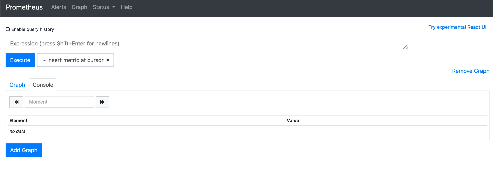
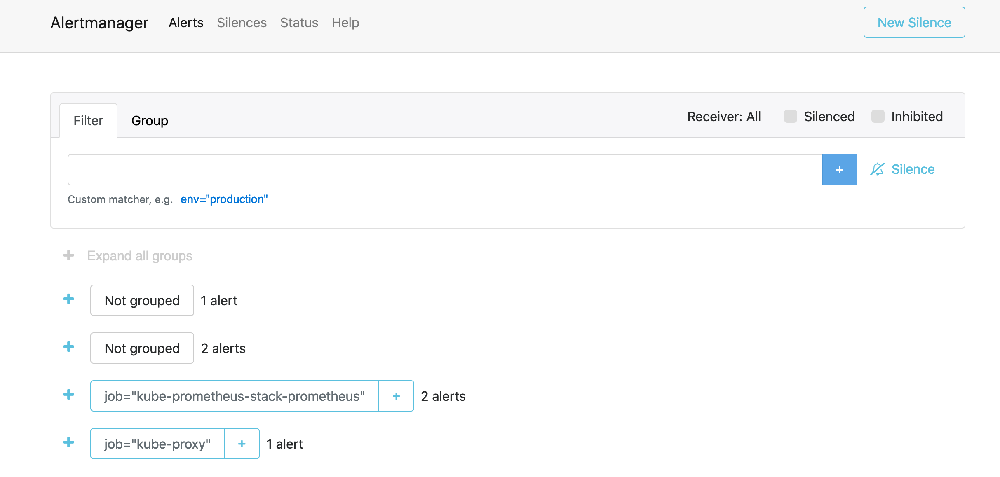
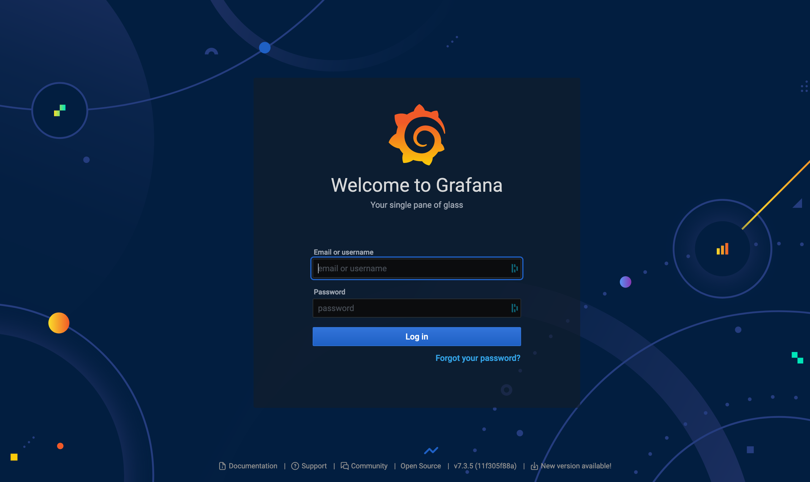

# Prometheus and Grafana Intergration

In this excerise we will be installing Prometheus and Grafana using helm to
monitor real-time metrics from NGINX Plus ingress controller

### **What is Prometheus?**

[Prometheus](https://prometheus.io) is an open-source monitoring and alerting
toolkit for recording time series data. It is excellent for monitoring both
traditional machine-centric and highly dynamic service-oriented architectures. 

The following characteristics make Prometheus a good match for monitoring
Kubernetes clusters: 

- **Pull-based monitoring:** Prometheus can dynamically discover and pull
  metrics from your services running in Kubernetes. 
- **Labels:** Prometheus and Kubernetes both use a label (key-value) concept
  that can select objects in the system to aggregate data across the label(s) 
- **Exporters:** Many exporters are available and enable integrating databases
  or even other monitoring systems not already providing a way to export metrics
  to Prometheus. 
- **Powerful query language:** The Prometheus query language, `PromQL`, allows
  aggregate time-series data in real-time. Results can be displayed as a graph,
  tabular data in the Prometheus expression browser, or consumed by external
  systems via the HTTP API.

### What is Grafana?

[Grafana](https://grafana.com/) is a very popular open-source metric analytics
and visualization suite often paired with Prometheus and other equivalent time
series data tools. Grafana accesses data via Data Sources. 

### What is Helm?

[Helm](https://helm.sh/) helps you manage Kubernetes applications — Helm Charts
help you define, install, and upgrade even the most complex Kubernetes
application.


## Prerequisites

Prometheus and Grafana can be easily deployed using Helm charts. The charts
bootstraps Prometheus and Grafana deployments on a Kubernetes cluster using the
Helm package manager

There are many variations of Prometheus and Grafana deployments. For this
exercise, we will install the [Prometheus
(kube-prometheus-stack)](https://artifacthub.io/packages/helm/prometheus-community/)
using helm that requires Kubernetes 1.16+, this helm char bundles a collection
of Kubernetes manifests, Grafana dashboards, and Prometheus rules, documentation
and scripts to provide easy to operate end-to-end monitoring with Prometheus


**Note:** By default this chart installs additional, dependent charts:

* [stable/kube-state-metrics](https://github.com/helm/charts/tree/master/stable/kube-state-metrics)
* [prometheus-community/prometheus-node-exporter](https://github.com/prometheus-community/helm-charts/tree/main/charts/prometheus-node-exporter)
* [grafana/grafana](https://github.com/grafana/helm-charts/tree/main/charts/grafana)


Ok, now lets get started


## Install `kube-prometheus-stack` using Helm

1. Make sure to have the [Helm package
   manager](https://helm.sh/docs/intro/install/) ready on your client machine.
   We will be using **Helm 3**. Here is the quick install taken from Helm's
   [documentation](https://helm.sh/docs/):

```bash
# Install Helm
curl -fsSL -o get_helm.sh https://raw.githubusercontent.com/helm/helm/master/scripts/get-helm-3
chmod 700 get_helm.sh
./get_helm.sh
```

2. Add the offical [Prometheus
   (`kube-prometheus-stack`)](https://artifacthub.io/packages/helm/prometheus-community/)
   helm chart sources


```bash
# Add Prometheus helm chart source
helm repo add prometheus-community https://prometheus-community.github.io/helm-charts
helm repo add stable https://charts.helm.sh/stable

# Check it has been added!
helm repo list    

# While we are at it, grab the latest from your chart repositories...
helm repo update

# Now we can find the repo we need for this excerise 
helm search repo prometheus-community/prometheus-stack
# ...And other Prometheus related repos
helm search repo prometheus-community/kube-prometheus-stack
# NOTICE: stable/prometheus is DEPRECATED (outdated) comapared to prometheus-community
helm search repo stable/prometheus
```

3. Create a namespace called `monitoring` to deploy Prometheus and Grafana in  

```bash
# Create the monitoring namespace
kubectl create ns monitoring
```

4. Install `kube-prometheus-stack` using helm in the `monitoring` namespace with
   the recommending options. 

We will not provide overrides to default values using a custom values file for
this step. Instead, we can use `--set-string` to pass configuration from the
command line and change the default Grafana password only. See [values.yaml file
from the project repo for all configurable
options](https://github.com/prometheus-community/helm-charts/blob/main/charts/kube-prometheus-stack/values.yaml)


**Options:**

By default, Prometheus discovers `PodMonitors` and `ServiceMonitors` *within its
namespace, which are labeled with the same release tag* as the
`prometheus-operator` release. 

To discover custom `PodMonitors` or `ServiceMonitors`, for example, to scrape
data from third-party applications, *we must allow Prometheus to discover all*
`PodMonitors` and `ServiceMonitors` within its namespace, *without applying
label filtering*. To do so, you can set:


```
prometheus.prometheusSpec.podMonitorSelectorNilUsesHelmValues=false
```

and

```
prometheus.prometheusSpec.serviceMonitorSelectorNilUsesHelmValues=false
```

Some resources that lead to the decision to use these options:  

* [[stable/prometheus-operator] No serviceMonitors are picked up from different
  namespaces #13196](https://github.com/helm/charts/issues/13196) 
* [How to monitor Nginx ingress controller?
  #2119](https://github.com/prometheus-operator/prometheus-operator/issues/2119)
  
* [PodMonitor vs ServiceMonitor what is the
  difference?](https://github.com/prometheus-operator/prometheus-operator/issues/3119)

Now run the [`helm install`](#earlier-step) command, This might take a while, so have patience
and do not abort:

```bash
# Install Prometheus helm chart from the prometheus-community repo with the 
# release name kube-prometheus-stack:
# helm install [RELEASE_NAME] prometheus-community/kube-prometheus-stack -n [namespace]
GRAFANA_PASSWORD=admin123
helm install --set-string grafana.adminPassword=$GRAFANA_PASSWORD \
  --set-string prometheus.prometheusSpec.serviceMonitorSelectorNilUsesHelmValues=false \
  kube-prometheus-stack \
  prometheus-community/kube-prometheus-stack \
  -n monitoring

# See the User supplied values at anytime
helm get values kube-prometheus-stack -n monitoring  
```

Eventually you will see the similar output upon a successful deployment:

```bash
NAME: kube-prometheus-stack
LAST DEPLOYED: Sat Dec 19 19:42:32 2020
NAMESPACE: monitoring
STATUS: deployed
REVISION: 1
NOTES:
kube-prometheus-stack has been installed. Check its status by running:
  kubectl --namespace monitoring get pods -l "release=kube-prometheus-stack"

Visit https://github.com/prometheus-operator/kube-prometheus for instructions on how to create & configure Alertmanager and Prometheus instances using the Operator.
```

5. Inspect the components deployed in the `monitoring` namespace and confirm the
   default Grafana password was changed

```bash
# Get all from the monitoring namespace
kubectl get all -n monitoring

# Get the grafana dashboard password at any time
kubectl get secret -n monitoring kube-prometheus-stack-grafana  -o jsonpath="{.data.admin-password}" | base64 --decode ; echo
```

Now you should have Prometheus server, alertmanager, kube-metrics, node
exporter, and Grafana deployed **(note: push gateway is not installed with this
helm chart**). Prometheus Helm chart provides default scrape configs to collect
metrics from Kubernetes apps inside your cluster.

 [Image Credit:
Sysdig](https://sysdig.com/blog/kubernetes-monitoring-with-prometheus-alertmanager-grafana-pushgateway-part-2/)

## Configure service, serviceMonitor for Prometheus

We will use a [`serviceMonitor`](#servicemonitor), a [*custom resource*
definition
(CRD)](https://kubernetes.io/docs/concepts/extend-kubernetes/api-extension/custom-resources/),
to describe a set of targets to be monitor by Prometheus, and create a `service`
that defines the scrape URL path and port with the metrics exported from our
NGINX Plus Prometheus Exporter

1. Create a Service and `ServiceMonitor` definition so Prometheus can target
   `nginx-ingress` metrics

```bash
# Create the ServiceMonitor:
kubectl apply -f deployments/prometheus-and-grafana/nginx-ingress-metrics-servicemonitor.yml 

# Create the prometheus service:
kubectl apply -f deployments/prometheus-and-grafana/nginx-ingress-metrics-prometheus-service.yaml
```

Check the `servicemonitor` and `service` exists

```bash
# Get services in the nginx-ingress namespace:
kubectl get services -n nginx-ingress     

NAME                               TYPE           CLUSTER-IP      EXTERNAL-IP                                                                    PORT(S)                      AGE
nginx-ingress-prometheus-service   ClusterIP      10.100.44.91    <none>                                                                         9113/TCP                     19s

# Get ServiceMonitor in the monitoring namespace:
kubectl get servicemonitor -n monitoring                           
NAME                    AGE
nginx-ingress-metrics   10s
```

#### Import Custom NGINX Plus Ingress Controller Dashboards for Grafana
We can import Dashboard into Grafana in two ways:
 1. [Import using UI or from the HTTP
    API](https://grafana.com/docs/grafana/latest/dashboards/export-import/)
 2. Import a `configmaps` during helm install or after and automatically picked
    up by Grafana

#### Option A: Import using UI or from the HTTP API

**Not covered in this excerise**. Refer to the [Grafana
Documentation](https://grafana.com/docs/grafana/latest/dashboards/export-import/)
to import the Grafana dashboards from the web UI or from the HTTP API, 

#### Option B: Import using ConfigMap

For this excerise we will be [importing](#import-grafana-dashboard) a custom
[NGINX Plus
Dashboard](https://github.com/nginxinc/kubernetes-ingress/blob/030e8fe3aa77f15ebf9fa408f3f1bb727a46aa7d/grafana/README.md)
custom graphs using `configmaps` to be automatically picked up by Grafana

1. Inspect the example `configMap` template for Grafana dashboards

See example below for a [`configMap`
template](deployments/prometheus-and-grafana/example-grafana-configmap.yaml),
and note the following:
 * The Label, `grafana_dashboard:1`, will allow Grafana to automatically pick up
   the dashboard in the `configMap`
 * Replace name, `my-grafana-dashboard-configmap`, with the dashboard name you
   desire
 * Replace namespace, `my-monitoring-namespace`, with the correct namespace that
   your `kube-prometheus-stack` is deployed in
 * You `json` formatted Grafana dashboard goes in the `data` section in the
   placeholder provided
 * YAML indentation is important. Use a online [YAML
   validator](https://codebeautify.org/yaml-validator) to check your syntax

```yaml
apiVersion: v1
kind: ConfigMap
metadata:
  labels:
    grafana_dashboard: "1"
  name: my-grafana-dashboard-configmap
  namespace: my-monitoring-namespace
data:
  my-dashboard.json: |-
    {
      "annotations": {
        "list": [
.
. this is were your dashboard json goes
.  
   }
```

2. Inspect the a complete `configMap` example including the NGINX Plus
   dashboard:
   [`nginx-plus-grafana-dashboard-configmap.yaml`](deployments/prometheus-and-grafana/nginx-plus-grafana-dashboard-configmap.yaml)

The NGINX Plus Dashboard in an exported Grafana dashboard json format is
[`NGINXPlusICDashboard.json`](deployments/prometheus-and-grafana/NGINXPlusICDashboard.json).
See the [NGINX Github
repo](https://github.com/nginxinc/kubernetes-ingress/tree/030e8fe3aa77f15ebf9fa408f3f1bb727a46aa7d/grafana)
for updated NGINX Plus Grafana Dashboards. 

3. Now import the dashboard using the `configMap` inspected in the last step

```bash
# Deploy our Grafana Dashboard
kubectl apply -f deployments/prometheus-and-grafana/nginx-plus-grafana-dashboard-configmap.yaml -n monitoring 

# Check its there or review at any time
kubectl describe configmaps/nginx-plus-grafana-dashboard-configmap -n monitoring   
```

4. You can later see this dashboard imported into Grafana under **Dashboards >
   Manage**


## Expose Prometheus, Alertmanager and Grafana

There are various ways to expose applications in Kubernetes. For this demo, we
will use our existing Ingress to expose Prometheus, Alertmanager, and Grafana
Web interfaces outside of Kubernetes.

### Option A: Expose services temporarily using Port Forward

Expose Prometheus, Alertmanager and Grafana using `port-forward`

If Ingress and load balancing is not set up, you can still access the Web
interfaces using port forwarding (`port-forward`) 

Find the Pods running the web interfaces for Prometheus, Alertmanager, and
Grafana by filtering on the app labels:

```bash
# You will find the prometheus frontend app with the label "app=prometheus"
kubectl get pods --namespace=monitoring -l "app=prometheus"

# You will find the alertmanager frontend app with the label "app=alertmanager"
kubectl get pods --namespace=monitoring -l "app=alertmanager"

# You will find the grafana frontend app with the label "app.kubernetes.io/name=grafana"
kubectl get pods --namespace=monitoring -l "app.kubernetes.io/name=grafana"            
```

#### Prometheus

1. Run `port-forward` to Prometheus using the pod name from the first step or
   with the following commands

```bash
POD_NAME=$(kubectl get pods --namespace monitoring -l "app=prometheus" -o jsonpath="{.items[0].metadata.name}")
# Forward port prometheus 9090 to localhost:
# kubectl port-forward -n monitoring prometheus-kube-prometheus-stack-prometheus-0 9090
kubectl port-forward -n monitoring $POD_NAME 9090
```

2. Now open Prometheus web interface in a web browser:

```bash
open http://localhost:9090/graph
```

3. You should be able to search and find NGINX ingress metrics



#### Alert Manager

1. Run `port-forward` to Alert Manager using the pod name from the first step or
   with the following commands

```bash
POD_NAME=$(kubectl get pods --namespace monitoring -l "app=alertmanager" -o jsonpath="{.items[0].metadata.name}")
# Forward port alertmanager 9093 to localhost:
# kubectl port-forward -n monitoring alertmanager-kube-prometheus-stack-alertmanager-0 9093
kubectl --namespace monitoring port-forward $POD_NAME 9093
```

2. Now open Alert Manager web interface in a web browser:

```bash
open http://localhost:9093/#/alerts
```

3. You should be able to view Alert Manager UI



#### Grafana 

1. Before we can access the Grafana web interface, we need to get the Grafana
   admin password when deployed through the helm chart should be prom-operator;
   you can log in using `admin/prom-operator`. In any case, you can find it
   using the `kubectl get secret` command

```bash 
# Get the grafana dashboard admin username
kubectl get secret -n monitoring kube-prometheus-stack-grafana  -o jsonpath="{.data.admin-user}" | base64 --decode ; echo

# Get the grafana dashboard admin password
kubectl get secret -n monitoring kube-prometheus-stack-grafana  -o jsonpath="{.data.admin-password}" | base64 --decode ; echo
```

2. Run `port-forward` to Grafana using the pod name from the first step or with
   the following commands

```bash
POD_NAME=$(kubectl get pods --namespace monitoring -l "app.kubernetes.io/name=grafana" -o jsonpath="{.items[0].metadata.name}")
# Forward port grafana 3000 to localhost:
# kubectl port-forward -n monitoring kube-prometheus-stack-grafana-d4946f7bd-99chc 3000
kubectl --namespace monitoring port-forward $POD_NAME 3000
```

2. Now open Grafana web interface in a web browser:

```bash
# login with admin / prom-operator
open http://localhost:3000/login
```

3. You should be able to log in to grafana using `admin` and the password specificed in the [earlier step](prometheus-and-grafana-helm-install.md#earlier-step)




### Option B: Expose services using Ingress

We can deploy `kube-prometheus-stack` along with ingress with  `helm` using
custom values (see
[`values.yaml`](https://github.com/prometheus-community/helm-charts/blob/main/charts/kube-prometheus-stack/values.yaml))

However, at the time of writing this lab (December 2020), the embedded Grafana
chart doesn't support (yet) the `apiVersion: networking.k8s.io/v1`; hence the
field `ingressClassName` is not set, which is a requirement for **Kubernetes >=
1.18.0** and Ingress resources that require the `ingressClassName` fieldset and
corresponds to the class of the Ingress Controller the user wants to use.
Because of this, we will deploy ingress independent from the helm chart
deployment

**WARNING:** If your Ingress is exposed to the internet, everyone can have full
access to your resources. It's strongly recommended to enable an external
authentication and Access Controls such as [API
key](https://www.nginx.com/blog/deploying-nginx-plus-as-an-api-gateway-part-1/#implement-auth),
[JWT
Auth](https://github.com/nginxinc/kubernetes-ingress/tree/master/examples/jwt),
or
[AllowList](https://docs.nginx.com/nginx/admin-guide/security-controls/controlling-access-proxied-tcp/)
IP addresses


1. Create an **insecure** Ingress resources for Prometheus, Alertmanager and
   Grafana

**Note:** Expose insecure Ingress on the internet for demo purposes. No Access
controls are applied to these exposed services. Your Grafana deployment may be
using the default username and password

```bash
# Create an ingress for Prometheus
kubectl apply -f deployments/prometheus-and-grafana/prometheus-ingress.yml

# Create an ingress for AlertManager
kubectl apply -f deployments/prometheus-and-grafana/alertmanager-ingress.yml

# Create an ingress for Grafana
kubectl apply -f deployments/prometheus-and-grafana/grafana-ingress.yml
```

2. We can confirm the `ingress` resources were deployed and all are using the
   `ingressClass: nginx`, as required for **Kubernetes version >= 1.18.0** only

```bash
kubectl get ingress -n monitoring
NAME                   CLASS   HOSTS                      ADDRESS   PORTS   AGE
alertmanager-ingress   nginx   alertmanager.example.com             80      100s
grafana-ingress        nginx   grafana.example.com                  80      97s
prometheus-ingress     nginx   prometheus.example.com               80      105s
```

3. If you do not already have a `LoadBalancer` in front of our Ingress
   Controllers, we can deploy one again for further reliability and convenience

Check to see you have a `loadBalancer` for `nginx-ingress`. If so move on to the
next step

```bash
# Check if you have a 'type=LoadBalancer' service for nginx-ingress
kubectl get services -n nginx-ingress
```

If you do not have a `loadBalancer` for `nginx-ingress`, we can deploy either a
ELB or NLB now:

```bash
# ELB
kubectl apply -f deployments/nginx-ingress/aws-elb-loadBalancer.yml
# NLB
kubectl apply -f deployments/nginx-ingress/aws-nlb-loadBalancer.yml
```

4. Now we can accessing Prometheus, Alert Manager and Grafana via `Loadbalancer`
   and our Ingress Controller :

```bash
# Get External loadBalancer address 
LB=$(kubectl get services/nginx-ingress -n nginx-ingress -o jsonpath='{.status.loadBalancer.ingress[*].hostname}')
LB_IP_ADDRESS=$(dig +short $LB A |  awk 'NR==1')

# Test Access to prometheus
curl -s -L http://$LB -H "Host: prometheus.example.com" | grep \<title\>

# Test Access to alertmanager
curl -s -L http://$LB -H "Host: alertmanager.example.com" | grep \<title\>

# Test Access to grafana
curl -s -L http://$LB -H "Host: grafana.example.com" | grep \<title\>        
```

You can also add a temporary host file entry and view the application in your
web browser

```bash
echo "$LB_IP_ADDRESS prometheus.example.com alertmanager.example.com grafana.example.com" | sudo tee -a /etc/hosts

open http://prometheus.example.com
open http://alertmanager.example.com
open http://grafana.example.com
```

## Export Ingress Controller metrics for Prometheus

Now we have our monitoring infrastructure setup; we can now expose our Ingress
Controller metrics to Prometheus.

The NGINX Plus Ingress Controller exposes many metrics in the Prometheus format
and can be enabled in the Kubernetes manifests or the command-line arguments as
custom values when using helm to install the Ingress Controller. See links below
to set that up:

 * [Enable NGINX Plus Ingress Controller metrics for Prometheus when deployed
   using Kubernetes
   manifests](nginx-plus-ingress-controller-prometheus-manifests-install.md)
   
 * Enable NGINX Plus Ingress Controller metrics for Prometheus when deployed
   using Helm installation

# Extra

## Upgrading the Chart

1. To upgrading the helm chart, run

```bash
# helm upgrade [RELEASE_NAME] prometheus-community/kube-prometheus-stack -n [namespace]
helm upgrade kube-prometheus-stack prometheus-community/kube-prometheus-stack
```

## Uninstalling the Chart

1. To uninstall and delete our helm deployment using our provided release name

The `helm delete` removes all the Kubernetes components associated with the
chart and deletes the release

```bash
# Delete helm chart deployment with the release name kube-prometheus-stack:
helm delete kube-prometheus-stack prometheus-community/kube-prometheus-stack -n monitoring
```

2. The CRDs created by this chart are **not removed by default**, to remove
   them, manually clean up using:

```bash
kubectl delete crd alertmanagerconfigs.monitoring.coreos.com
kubectl delete crd alertmanagers.monitoring.coreos.com
kubectl delete crd podmonitors.monitoring.coreos.com
kubectl delete crd probes.monitoring.coreos.com
kubectl delete crd prometheuses.monitoring.coreos.com
kubectl delete crd prometheusrules.monitoring.coreos.com
kubectl delete crd servicemonitors.monitoring.coreos.com
kubectl delete crd thanosrulers.monitoring.coreos.com
```

## Delete the designated monitoring namespace

1. Delete the namespace, `monitoring`, where we deployed Prometheus and Grafana   

```bash
# Create the monitoring namespace
kubectl delete ns monitoring
```
