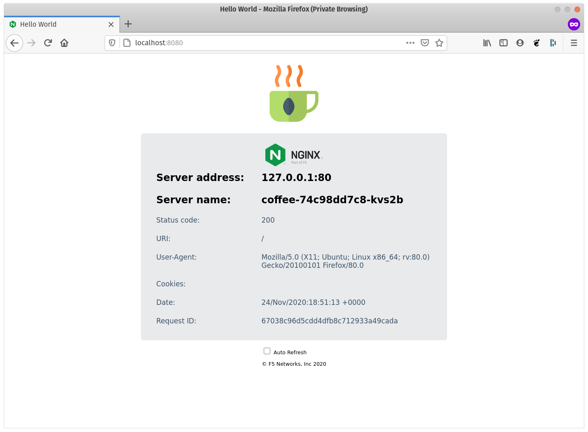

# Port-forward


Port forwarding is a convenient tool that can help you debug applications and deployments withinyour Kubernetes cluster. The Kubernetes API server establishes a single HTTP  connection between your localhost and the resource running on your  cluster, allowing you to engage that specific pod directly, either to diagnose an issue or debug if necessary.


Lets try  `port-forward` command to one our applications

## Run port-forward to access our Application


1. Get a list of **coffee** and **tea** `pods` in our **cafe** `namespace`

```output
kubectl get pods -n cafe

NAME                      READY   STATUS    RESTARTS   AGE
coffee-74c98dd7c8-kvs2b   1/1     Running   0          3d23h
tea-7dcd6f57b6-kztrd      1/1     Running   0          3d23h
```


2. Use the `kubectl describe` command to confirm the `Port` the pod is listening on

```
kubectl describe pods coffee-74c98dd7c8-kvs2b -n cafe 

#...
Port:           80/TCP
#...
```

In this example, our Coffee application listens on `80/TCP` . We will use that port in the next step running the `kubectl port-forward` command

2. `kubectl port-forward` allows using resource name, such as a pod name, to select a matching pod to port forward to. Pick a pod name from the last step and connect directly using `port-forward` by running the command

```
# Listen on the specified port 8080, locally, and forward to port 80 within the specified pod:
kubectl port-forward pod/coffee-74c98dd7c8-kvs2b 8080:80 -n cafe

# Listen on a random port locally, and forward to port 80 within the specified pod:
kubectl port-forward pod/coffee-74c98dd7c8-kvs2b :80 -n cafe
```

3. We can now access the the application over `localhost:[port]`, In a web browser, or using command line tools like `curl`

```
curl -s localhost:8080 | grep title

<title>Hello World</title>
```




4. Hit `Ctrl+C` to close the port-forward connection from your client to the Kubernetes cluster